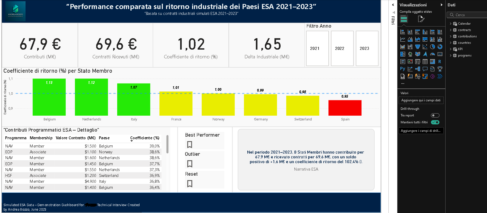

Hi, this is my personal portfolio and repository for my own free projects.
I'm currently using PowerBi and Excel mostly, but i will soon try to upload SQL content. Read INTRODUCTION file for the repository projects explanation.

## Dashboard Features

This Business Intelligence dashboard demonstrates advanced data visualization capabilities for ESA industrial performance analysis (2021-2023), featuring:

- **KPI Cards**: Key financial metrics including total contributions (67.9 M€), received contracts (69.6 M€), return coefficient (1.02), and industrial delta (1.65)
- **Interactive Filtering**: Year-based filters (2021, 2022, 2023) for temporal analysis
- **Country Performance Analysis**: Color-coded bar chart showing return coefficients by EU member states with performance indicators (green for high performance, yellow for medium, red for underperformance)
- **Detailed Program Breakdown**: Comprehensive table displaying ESA programs with membership details, contract values, countries, and performance coefficients
- **Advanced Controls**: Best performer highlighting, outlier detection, and reset functionality
- **Responsive Design**: Clean, professional interface with intuitive navigation and data exploration tools

For business inquiries;
andreabozzo92@gmail.com
